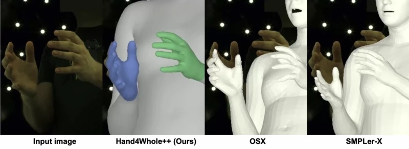

# Hand4Whole++ (CVPR 2026)

## [Project Page](https://mks0601.github.io/Hand4Whole-plus-plus/) | [Paper]() | [Video]() 

* Hand4Whole++ is a powerful framework designed to significantly boost hand accuracy in 3D whole-body pose estimation by seamlessly integrating high-quality hand details into full-body models.

<p align="middle">

</p>
<p align="center">
Compared to previous 3D whole-body pose estimation methods, our Hand4Whole++ recovers better hands and upper-body poses even for challeing hand-centric images.<br>
For more high-resolution demo videos, please visit our <A href="https://mks0601.github.io/Hand4Whole-plus-plus/">website</A>.
</p>


## Install
* To install a conda environment and necessary packages, run below.
```
conda env create -f environment.yml
conda activate h4wpp
```
* Slightly change `torchgeometry` kernel code following [[here](https://github.com/mks0601/I2L-MeshNet_RELEASE/issues/6#issuecomment-675152527)].
* Move to `common/nets` and clone [[WiLoR](https://github.com/rolpotamias/WiLoR)] and download its pretrained weights following the instruction.
* Move to `common/nets` and download [[mmpose](https://drive.google.com/file/d/1Rxjb9l5m49lhoxfW0ohubl19vVRx9Q_n/view?usp=sharing)]. Place [[DWPose](https://drive.google.com/file/d/1PHKN3p873dgCSh_YRsYqTZVj-kIbclRS/view?usp=sharing)] at `common/nets/mmpose/dw-ll_ucoco.pth`.


## Demo
* Download the pre-trained Hand4Whole++ from [here](https://drive.google.com/drive/folders/1sDWjihPLcjJNTzQbGUedJ3zaK0AyalBt?usp=sharing).
* Prepare images in `demo/inputs` and pre-trained checkpoints at `demo` folder.
* Prepare `human_model_files` folder following below `Directory` part and place it at `common/utils/human_model_files`.
* Run `python demo.py`.
* Outputs will be saved in `demo/outputs`.

## Directory  
### Root  
The `${ROOT}` is described as below.  
```  
${ROOT}  
|-- data  
|-- demo
|-- main  
|-- tool
|-- output  
|-- common
|   |-- utils
|   |   |-- human_model_files
|   |   |   |-- smpl
|   |   |   |   |-- SMPL_NEUTRAL.pkl
|   |   |   |-- smplx
|   |   |   |   |-- MANO_SMPLX_vertex_ids.pkl
|   |   |   |   |-- SMPL-X__FLAME_vertex_ids.npy
|   |   |   |   |-- SMPLX_NEUTRAL.pkl
|   |   |   |   |-- SMPLX_to_J14.pkl
|   |   |   |-- mano
|   |   |   |   |-- MANO_LEFT.pkl
|   |   |   |   |-- MANO_RIGHT.pkl
|   |   |   |-- flame
|   |   |   |   |-- flame_dynamic_embedding.npy
|   |   |   |   |-- flame_static_embedding.pkl
|   |   |   |   |-- FLAME_NEUTRAL.pkl
|   |-- nets
|   |   |-- mmpose
|   |   |-- WiLoR
```  
* `data` contains data loading codes and soft links to images and annotations directories.  
* `demo` contains demo codes.
* `main` contains high-level codes for training or testing the network.  
* `tool` contains pre-processing codes of AGORA and pytorch model editing codes.
* `output` contains log, trained models, visualized outputs, and test result.  
* `common` contains kernel codes for Hand4Whole.  
* `human_model_files` contains `smpl`, `smplx`, `mano`, and `flame` 3D model files. Download the files from [[smpl]](https://smpl.is.tue.mpg.de/) [[smplx]](https://smpl-x.is.tue.mpg.de/) [[SMPLX_to_J14.pkl]](https://github.com/vchoutas/expose#preparing-the-data) [[mano]](https://mano.is.tue.mpg.de/) [[flame]](https://flame.is.tue.mpg.de/).
  
### Data  
You need to follow directory structure of the `data` as below.  
```  
${ROOT}  
|-- data  
|   |-- AGORA
|   |   |-- data
|   |   |   |-- AGORA_train.json
|   |   |   |-- AGORA_validation.json
|   |   |   |-- AGORA_test_bbox.json
|   |   |   |-- images_1280x720
|   |   |   |-- images_3840x2160
|   |   |   |-- smplx_params_cam
|   |   |   |-- cam_params
|   |-- ARCTIC
|   |   |-- data
|   |   |   |-- bbox
|   |   |   |-- images_1k
|   |   |   |-- mano_left_shape_param
|   |   |   |-- meta
|   |   |   |-- raw_seqs
|   |   |   |-- smplx_shape_param
|   |   |   |-- splits_json
|   |-- EHF
|   |   |-- data
|   |   |   |-- EHF.json
|   |-- HIC
|   |   |-- data
|   |   |   |-- HIC.json
|   |-- InterHand26M
|   |   |-- images
|   |   |-- annotations
|   |-- ReInterHand
|   |   |-- data
```
* AGORA: [[preprocessing code](https://github.com/mks0601/Hand4Whole_RELEASE/tree/main/tool/AGORA)] [[preprocessing code 2](tool/AGORA/get_smplx_beta.py)]
* ARCTIC: [[preprocessing code](tool/ARCTIC/downsample_to_1k.py)] [[parsed data](https://drive.google.com/drive/folders/1-QXFSBd_Vat6qYoU26XWKMqATwfceo9i?usp=sharing)]
* EHF: [[parsed data](https://drive.google.com/file/d/1Ji2PuB2HYQzRpQ016LwSSLguFMezQqOI/view?usp=sharing)]
* HIC: [[parsed data](https://drive.google.com/file/d/1oqquzJ7DY728M8zQoCYvvuZEBh8L8zkQ/view?usp=sharing)]
* InterHand26M: [[dataset](https://mks0601.github.io/InterHand2.6M/)] [[train split](https://drive.google.com/file/d/1nrqkx7hMpWFuQMqGlyGqp-yoQ-pXGfAE/view?usp=sharing)] [[test split](https://drive.google.com/file/d/1jyDomXuTCYH-LRdBnU7j_bMFHHMVe-C2/view?usp=sharing)] [[preprocessing code](tool/InterHand26M/)]
* ReInterHand: [[dataset](https://mks0601.github.io/ReInterHand/)] [[preprocessing code](tool/ReInterHand/)]
  
  
### Output  
`output` folder is autometically generated as below.  
```  
${ROOT}  
|-- output  
|   |-- log  
|   |-- model_dump  
|   |-- result  
|   |-- vis  
```  
* Creating `output` folder as soft link form is recommended instead of folder form because it would take large storage capacity.  
* `log` folder contains training log file.  
* `model_dump` folder contains saved checkpoints for each epoch.  
* `result` folder contains final estimation files generated in the testing stage.  
* `vis` folder contains visualized results.  


## Running Hand4Whole
* In the `main/config.py`, you can change datasets to use.  

### Train
* Move to `tool` and download [[SMPLer-X](https://huggingface.co/caizhongang/SMPLer-X/resolve/main/smpler_x_l32.pth.tar?download=true)] and [[Hand4Whole](https://drive.google.com/file/d/1r0LfI_ATI8NmhOj4y8eqLlEDdNQj5SCV/view?usp=sharing)].
* In the `tool` folder, run `python combine_smplerx_h4w_face`, which combines SMPLer-X and face regression part of Hand4Whole and dumps `snapshot_0.pth`.
* Move the dumped `snapshot_0.pth` to `model_dir` in `main/config.py`.
* In the `main` folder, run  
```bash  
python train.py --continue
```  

### Test
Place trained model at the `model_dir` in `main/config.py`. 
  
In the `main` folder, run  
```bash  
python test.py --test_epoch 6
```  
to test Hand4Whole++ with `snapshot_6.pth`.

## Models
* Download the pre-trained Hand4Whole++ from [here](https://drive.google.com/drive/folders/1sDWjihPLcjJNTzQbGUedJ3zaK0AyalBt?usp=sharing).


## Reference
```
@inproceedings{moon2026h4wpp,
  title={Enhancing Hands in 3D Whole-Body Pose Estimation with Conditional Hands Modulator},
  author={Moon, Gyeongsik},  
  booktitle={CVPR},
  year={2026}
}
```

